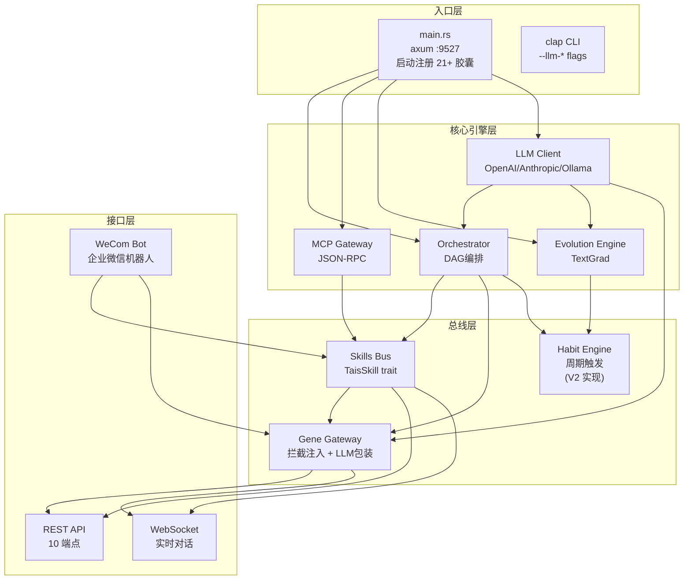
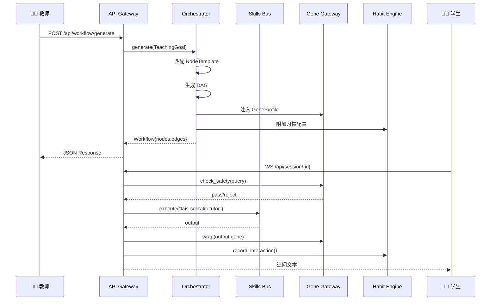
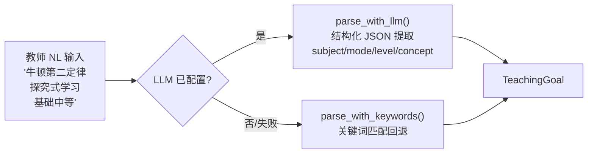
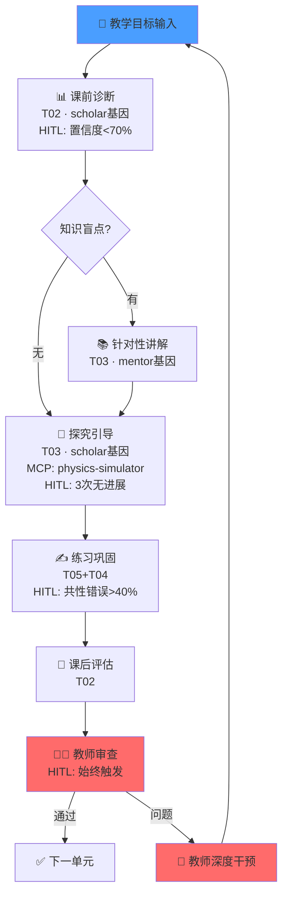
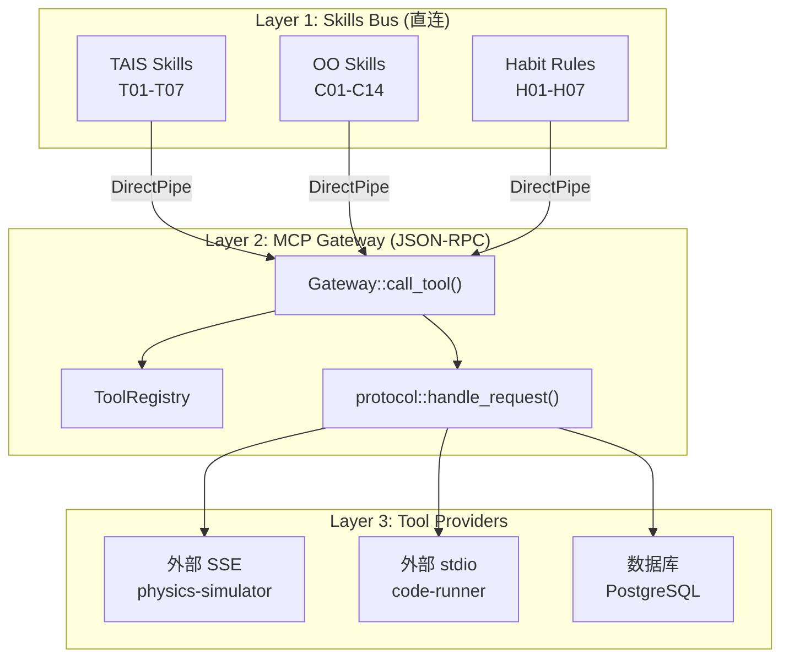
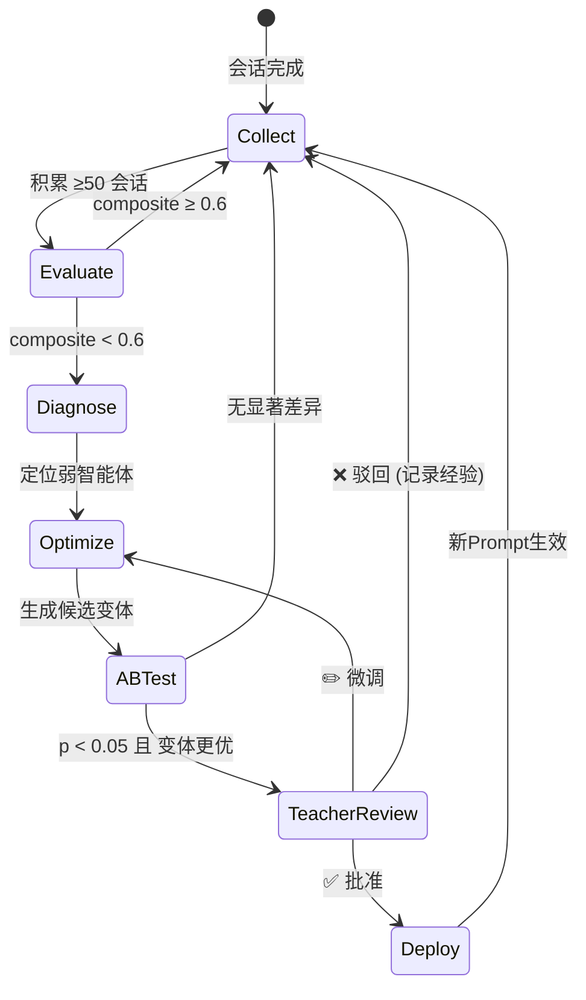
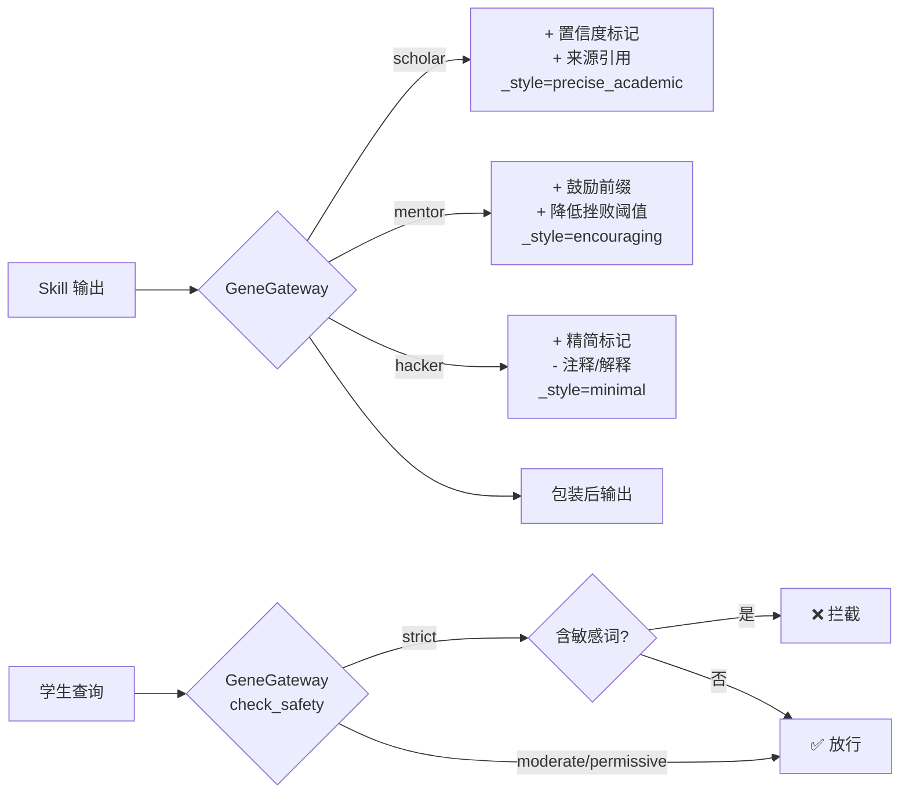
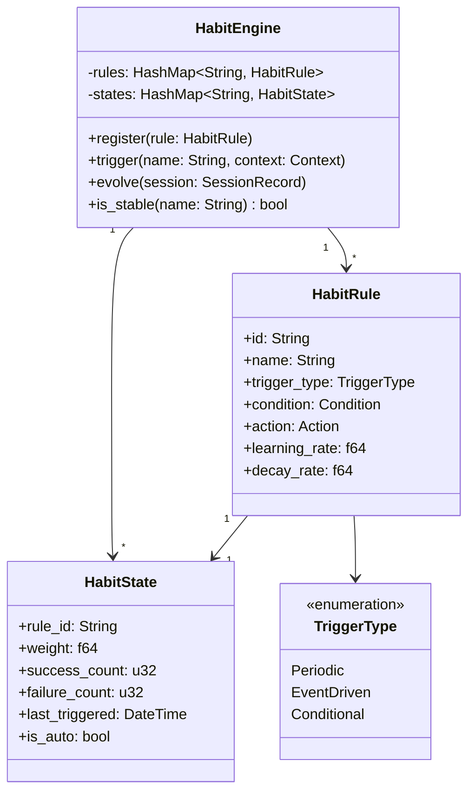
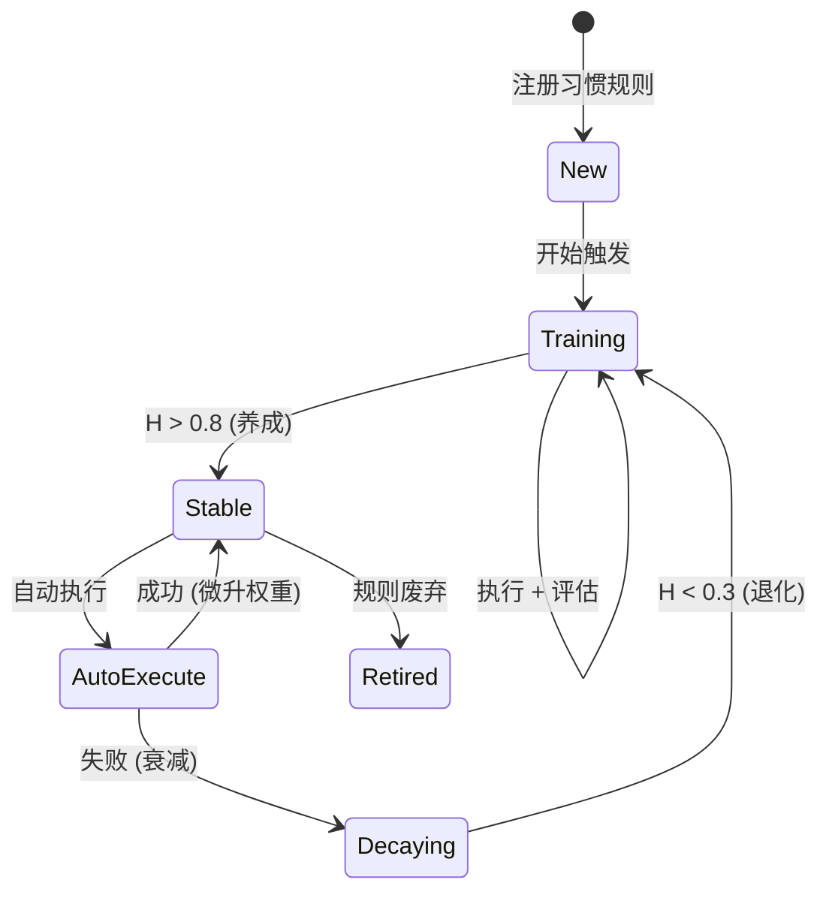
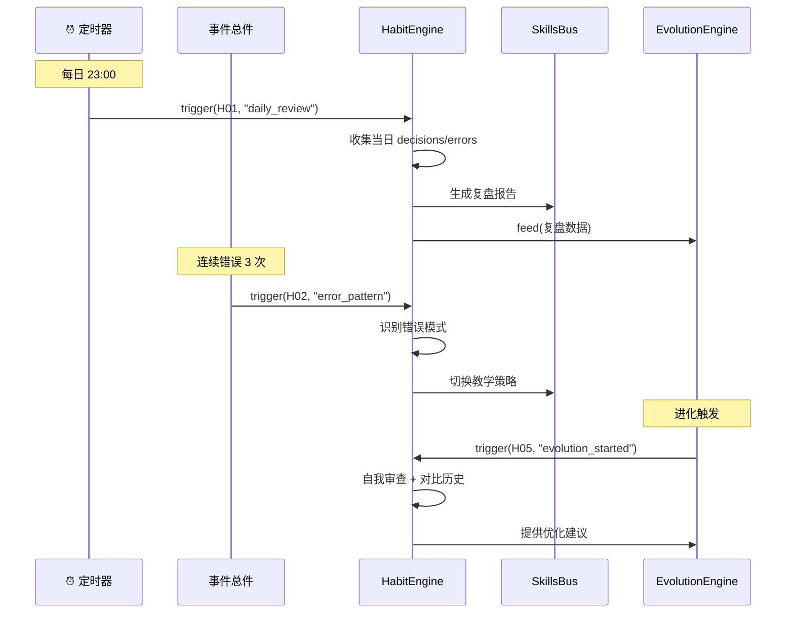

# TAIS Core Engine — 实现文档

> Rust 2024 · 21 文件 · 3,400+ 行 · 11/11 测试通过  
> 三胶囊体系: 能力(术) × 基因(道) × 习惯(习)  
> LLM 支持: OpenAI 兼容 / Anthropic / Ollama · 企业微信机器人集成

---

## 1. 系统架构



### 模块调用时序



---

## 2. Orchestrator 编排引擎

### 目标解析

支持双路径解析：LLM 优先，规则回退。



**LLM 路径**: 发送 system prompt 要求返回 `{subject, concept, mode, level, constraints}` JSON，解析后映射到枚举类型。

**规则回退路径**:
- mode: 关键词匹配 (探究→InquiryBased, 苏格拉底→SocraticDialogue, ...)
- level: 关键词匹配 (基础→Beginner, 高级→Advanced, ...)
- subject: 关键词匹配 (物理/数学/化学/编程/写作)
- concept: 「」内文本提取

### DAG 生成

输入 `TeachingGoal` 后，Orchestrator 按以下算法生成 `Workflow`：

**算法 1: 工作流 DAG 生成**

1. 按 `goal.mode` 筛选匹配的 `NodeTemplate[]`
2. 按 `phase` 升序排列（0=课前, 1=课中, 2=课后, 3=审查）
3. 对每个模板：实例化为 `WorkflowNode`，注入 `gene` 和 `hitl_trigger`
4. 按序添加边 $v_i \to v_{i+1}$
5. 追加终端审查节点（始终触发 HITL）

时间复杂度：$O(n \log n)$，其中 $n$ 为模板数量。



### 节点执行

每个节点执行时：

1. **基因注入**: `GeneGateway::modify_parameters()`
2. **技能调度**: `SkillsBus::execute(agent, input, gene)`
3. **基因包装**: `GeneGateway::wrap(output, gene)`
4. **HITL 检查**: 评估触发条件，生成 `HitlEvent`
5. **习惯记录**: `HabitEngine::record_node_result()`

---

## 3. MCP Gateway

### 三层架构



### JSON-RPC 协议

**请求格式**:

```json
{
  "jsonrpc": "2.0",
  "id": 1,
  "method": "tools/call",
  "params": {
    "name": "physics-simulator",
    "arguments": {"force": 10, "mass": 2}
  }
}
```

**调用路径选择**:

```
call_tool(name, params):
  1. direct_pipes.get(name)   → 命中: 直接调用 (零延迟)
  2. external_servers.find()  → 命中: POST SSE / 启动 stdio
  3. 都不命中                   → ToolNotFound
```

### 工具注册

启动时从 `main.rs` 批量注册 35 个胶囊：

```
oo-prd-generator ... oo-code-scaffold  (14 OO)
gene-personality ... gene-heredity     (7 基因)
tais-workflow ... tais-evolution       (7 TAIS)
habit-review ... habit-collaboration   (7 习惯)
```

---

## 4. Evolution Engine 自进化引擎

### 进化闭环



### 多维评估指标

评估函数 $E: \text{SessionRecord}[] \to \text{EvolutionMetrics}$

**1. 学习有效性 (Learning Effectiveness)** — 归一化增益

$$\text{LE} = \frac{1}{N}\sum_{i=1}^{N} \frac{\text{post}_i - \text{pre}_i}{1 - \text{pre}_i}$$

权重：$w_1 = 0.35$

**2. 教学效率 (Teaching Efficiency)** — 突破率

$$\text{TE} = \frac{1}{N}\sum_{i=1}^{N} \frac{\text{breakthroughs}_i}{\text{rounds}_i}$$

权重：$w_2 = 0.25$

**3. 学生自主性 (Student Autonomy)** — HITL 独立率

$$\text{SA} = 1 - \frac{1}{N}\sum_{i=1}^{N} \min(\text{hitl\_escalations}_i, 1)$$

权重：$w_3 = 0.20$

**4. 资源参与度 (Resource Engagement)** — 点击率

$$\text{RE} = \frac{\sum \text{clicked}_i}{\sum \text{pushed}_i}$$

权重：$w_4 = 0.10$

**5. 教师满意度 (Teacher Satisfaction)** — 人工评分

$$\text{TS} = \frac{1}{|\{i: \text{rated}_i\}|}\sum_{i: \text{rated}} \text{rating}_i$$

权重：$w_5 = 0.10$

**综合评分**:

$$\text{composite} = \sum_{k=1}^{5} w_k \cdot \text{metric}_k$$

---

### TextGrad 优化

**双路径**: LLM 优化优先，规则模板回退。

`generate_variant_with_llm(current_prompt, diagnosis, llm)`:
1. 若 LLM 已配置 → 调用 LLM 生成改进后的完整 prompt
2. 若 LLM 不可用/失败 → 回退到规则模板拼接

LLM system prompt: 给当前 prompt + 弱点诊断，要求 LLM 直接输出改进后的 prompt 文本。

规则回退（V1 算法）: 根据 diagnosis 关键词追加具体指令（拆解问题/限制推送/分层反馈/增强自主性）。

---

### A/B 统计检验

采用 Welch's t-test:

$$t = \frac{\bar{X}_v - \bar{X}_c}{\sqrt{\frac{s_v^2}{n_v} + \frac{s_c^2}{n_c}}}$$

自由度 (Welch-Satterthwaite):

$$\nu = \frac{\left(\frac{s_v^2}{n_v} + \frac{s_c^2}{n_c}\right)^2}{\frac{(s_v^2/n_v)^2}{n_v-1} + \frac{(s_c^2/n_c)^2}{n_c-1}}$$

判定：若 $p < 0.05$ 且 $\bar{X}_v > \bar{X}_c$，则变体显著更优。

---

## 5. 基因网关

### 拦截模型



### 人格参数修改

| 基因 | 注入参数 | 规则效果 | LLM 增强 |
|------|---------|---------|---------|
| scholar | `precision=high, citation_required=true` | 追加置信度标记 | LLM 重写为严谨学术风格 |
| mentor | `tone=warm, max_frustration_rounds=5` | 追加鼓励前缀 | LLM 重写为温暖鼓励风格 |
| hacker | `brevity=max, comments=false` | 追加 `[精简]` 标记 | LLM 智能压缩到最小 |

`GeneGateway::wrap_with_llm()` 在 LLM 可用时调用 LLM 进行风格转换，失败时回退到 `wrap()` 的字符串拼接。

---

## 6. LLM 统一客户端 (`src/llm/mod.rs`)

支持三种 LLM 后端的统一接口，配置存储在 `Arc<RwLock<Option<Arc<LlmClient>>>>` 中，支持运行时动态切换。

### 后端映射

| 后端 | API 端点 | 认证头 | 请求格式 |
|------|---------|--------|---------| 
| OpenAI 兼容 | `{api_base}/v1/chat/completions` | `Authorization: Bearer {key}` | `{model, messages, temperature, max_tokens}` |
| Anthropic | `{api_base}/v1/messages` | `x-api-key: {key}` | `{model, system, messages, max_tokens}` |
| Ollama | `{api_base}/api/chat` | 无 | `{model, messages, stream: false}` |

### 公共 API

```rust
impl LlmClient {
    pub fn new(config: LlmConfig) -> Self;
    pub fn config(&self) -> &LlmConfig;
    pub async fn chat(&self, messages: &[ChatMessage], options: Option<&ChatOptions>) -> Result<ChatResponse, LlmError>;
    pub async fn complete(&self, system_prompt: &str, user_prompt: &str) -> Result<String, LlmError>;
}
```

### 接入模块

```
parser::parse_goal()     → LLM 结构化提取 (回退: 关键词匹配)
optimizer::generate_variant_with_llm() → LLM prompt 优化 (回退: 规则模板)
GeneGateway::wrap_with_llm() → LLM 风格重写 (回退: 字符串拼接)
```

### 配置优先级

```
CLI flags (最高) > 环境变量 > tais.toml > 首页表单 (运行时更新)
```

首页 `POST /api/config/llm` 更新运行时配置并写入 tais.toml，无需重启。

---

## 6. 习惯引擎 (Habit Engine) — V2 实现

### 架构



### 习惯状态更新

```rust
impl HabitEngine {
    /// 更新习惯权重
    pub fn update_weight(&mut self, rule_id: &str, success: bool) {
        let state = self.states.get_mut(rule_id);
        let eta = self.rules[rule_id].learning_rate;
        let lambda = self.rules[rule_id].decay_rate;

        // H(t+1) = H(t) + η·success - λ·(1 - frequency)
        let frequency = state.recent_frequency(20); // 滑动窗口 N=20
        if success {
            state.weight = (state.weight + eta).min(1.0);
            state.success_count += 1;
        } else {
            state.weight = (state.weight - lambda * (1.0 - frequency)).max(0.0);
            state.failure_count += 1;
        }

        // 检查习惯是否稳定
        if state.weight > THETA_STABLE {  // θ_stable = 0.8
            state.is_auto = true;  // 自动执行
        }
        if state.weight < THETA_RETRAIN {  // θ_retrain = 0.3
            state.is_auto = false;  // 重新训练
        }
    }
}
```

### 习惯生命周期



### 习惯触发时序



---

## 7. 核心类型定义

### 习惯胶囊类型

```rust
/// 习惯规则定义
pub struct HabitRule {
    pub id: String,
    pub name: String,
    pub description: String,
    pub trigger_type: HabitTriggerType,
    pub condition: HabitCondition,
    pub action: HabitAction,
    pub learning_rate: f64,  // η
    pub decay_rate: f64,     // λ
}

/// 触发类型
pub enum HabitTriggerType {
    Periodic { interval: chrono::Duration },
    EventDriven { event: String },
    Conditional { predicate: String },
}

/// 习惯状态
pub struct HabitState {
    pub rule_id: String,
    pub weight: f64,           // H(t) ∈ [0, 1]
    pub success_count: u32,
    pub failure_count: u32,
    pub streak: u32,           // 连续成功次数
    pub last_triggered: chrono::NaiveDateTime,
    pub is_auto: bool,         // 是否自动执行
}

/// 习惯条件
pub enum HabitCondition {
    Always,
    ErrorPattern { consecutive_errors: u32 },
    CompositeBelow { threshold: f64 },
    HighRiskOperation,
    CollaborationMode,
}
```

### 三胶囊联动接口

```rust
/// Agent 执行上下文 — 三胶囊同时注入
pub struct AgentContext {
    pub capabilities: Vec<String>,  // 能力胶囊名
    pub gene_profile: GeneProfile,  // 基因配置
    pub habit_state: Vec<HabitState>, // 当前习惯状态
}

/// 三胶囊联动执行
impl AgentContext {
    pub async fn execute(
        &mut self,
        skill_name: &str,
        input: Value,
    ) -> Result<Value, Error> {
        // 1. 基因注入参数
        let mut params = input.clone();
        GeneGateway::modify_parameters(&mut params, &self.gene_profile);

        // 2. 习惯前置检查
        for habit in &self.habit_state {
            if habit.is_auto {
                // 自动执行习惯动作
                params = self.apply_habit(habit, params);
            }
        }

        // 3. 执行技能
        let output = self.skills_bus.execute(skill_name, params).await?;

        // 4. 基因包装输出
        let wrapped = GeneGateway::wrap(&output, &self.gene_profile);

        // 5. 习惯后置记录
        self.habit_engine.record(skill_name, &wrapped);

        Ok(wrapped)
    }
}
```

---

## 8. 测试覆盖

```
11/11 passed ✅

orchestrator::parser
  test_parse_inquiry_goal  — "探究式学习牛顿第二定律" → InquiryBased + 物理
  test_parse_socratic      — "苏格拉底式追问" → SocraticDialogue

orchestrator::dag
  test_dag_order           — 3节点DAG: 诊断→导入→练习

evolution::evaluator
  test_perfect_session     — post=1.0 → LE > 0.9, SA = 1.0
  test_poor_session        — post=0.4 → LE < 0.1, SA = 0.0

evolution::optimizer
  test_variant_generation  — 新Prompt含[自进化优化 v1]
  test_ab_significant      — variant显著优于control (p < 0.05)
  test_ab_not_significant  — 无显著差异

gene
  test_scholar_wrap        — scholar基因加置信度标记
  test_mentor_wrap         — mentor基因加鼓励前缀
  test_safety_block        — strict模式拦截"帮我写全部代码"
```

---

## 9. 性能特征

| 操作 | 复杂度 | 说明 |
|------|--------|------|
| 工作流生成 | $O(n \log n)$ | n=模板数量(常数级) |
| MCP 工具调用 | $O(1)$ 直连 / $O(m)$ SSE | m=外部服务器数 |
| 进化评估 | $O(N)$ | N=会话数 |
| 习惯状态更新 | $O(1)$ | HashMap 查找 |
| DAG 拓扑排序 | $O(V+E)$ | petgraph 标准算法 |

---

## 10. 编译与运行

### 环境要求

- Rust 1.95+ (2024 Edition)
- PostgreSQL 15+ (可选，V2 启用)

### 编译

```bash
cd tais-core
cargo build              # 开发构建
cargo build --release    # 生产构建
```

### 运行

```bash
# 基础运行
cargo run
# → TAIS server listening on http://0.0.0.0:9527

# 配置 LLM（3 种方式，优先级顺序）
cargo run -- --llm-provider ollama --llm-api-base http://localhost:11434 --llm-model llama3
TAIS_LLM_PROVIDER=openai TAIS_LLM_API_KEY=sk-xxx cargo run
# 或通过首页 http://localhost:9527/ 配置（无需重启）
```

### 测试

```bash
cargo test
# → 11 passed, 0 failed
```

### LLM 配置

| 配置方式 | 优先级 | 持久化 |
|---------|--------|-------|
| CLI flags (`--llm-*`) | 最高 | 否 |
| 环境变量 (`TAIS_LLM_*`) | 中 | 否 |
| tais.toml `[llm]` 节 | 低 | 是 |
| 首页 `POST /api/config/llm` | 运行时 | 是 (写入 tais.toml) |

支持三种后端: OpenAI 兼容 API / Anthropic / Ollama。未配置时所有模块回退到规则引擎。

---

## 11. 关键设计决策

| 决策 | 理由 |
|------|------|
| **Rust 而非 Python** | 类型安全 + 零成本抽象 + 无 GIL（WebSocket 并发） + 部署单二进制 |
| **petgraph DAG** | 教学流程天然是有向无环图，拓扑排序 $O(V+E)$ 确保执行顺序 |
| **静态方法 GeneGateway** | 基因注入是无状态的纯函数，不需要实例化 |
| **HabitEngine 为独立模块** | 习惯引擎有自己的生命周期（周期触发），与 Skills Bus 解耦 |
| **规则解析而非 LLM** | V1 用规则做目标解析和变体生成，减少外部依赖；V2 换 LLM |
| **教师审查闸门默认关闭** | 安全优先：任何时候 `auto_deploy=false` |
| **trait 基 Skills + Habits** | 新胶囊即插即用，符合开闭原则 |
| **JSON-RPC MCP** | 与 MCP 官方协议对齐，工具可跨系统复用 |
| **SSE 优先 MCP 传输** | stdio 需要子进程管理，V1 先用 SSE（HTTP）；V2 加 stdio |

---

## 12. 待实现 (V2)

| 优先级 | 功能 | 工作量 |
|--------|------|--------|
| P0 | ✅ 接入真实 LLM（目标解析 + 变体生成 + 基因包装） | ✅ 已完成 |
| P0 | 企业微信机器人集成 | 2天 |
| P0 | PostgreSQL 持久化（sqlx migrate + repo） | 2天 |
| P0 | **习惯引擎实现**（HabitEngine + 7个习惯胶囊） | 5天 |
| P1 | MCP stdio 传输（子进程管理） | 2天 |
| P1 | 7 个 TAIS 技能注册到 SkillsBus | 2天 |
| P1 | 习惯跨代遗传（gene-heredity 集成） | 3天 |
| P2 | 进化自动触发（事件驱动） | 1天 |
| P2 | 知识图谱 + 向量检索 | 5天 |
| P3 | 可视化仪表盘 | 5天 |

---

## 13. 项目结构树

```
tais/
├── CLAUDE.md                   AI 助手指南
├── tais-core-PRD.md           产品需求文档
├── tais-core-IMPL.md          实现文档（本文档）
└── tais-core/
    ├── Cargo.toml              (70行) 依赖声明
    ├── Cargo.lock              (自动生成)
    ├── tais.toml               (运行时配置，自动生成)
    └── src/
        ├── main.rs             (175行) 入口 + clap CLI + 21胶囊注册
        ├── lib.rs              (226行) 核心类型 + MCP RPC
        ├── config.rs           (120行) 配置 + env/CLI/TOML 合并
        ├── llm/
        │   └── mod.rs          (290行) 统一 LLM 客户端 (OpenAI/Anthropic/Ollama)
        ├── api/
        │   └── mod.rs          (340行) axum 路由 (10端点) + 动态首页 + WebSocket
        ├── orchestrator/
        │   ├── mod.rs          (224行) Orchestrator + 模板
        │   ├── parser.rs       (160行) NL→TeachingGoal (LLM优先+规则回退)
        │   ├── dag.rs          (101行) petgraph DAG
        │   └── executor.rs     (130行) 节点执行 + HITL
        ├── mcp/
        │   ├── mod.rs          (169行) Gateway
        │   ├── protocol.rs     (54行)  JSON-RPC 处理
        │   └── registry.rs     (36行)  工具注册表
        ├── evolution/
        │   ├── mod.rs          (185行) EvolutionEngine
        │   ├── collector.rs    (56行)  会话聚合
        │   ├── evaluator.rs    (123行) 五维指标
        │   └── optimizer.rs    (200行) 变体生成 (LLM优先+规则回退) + A/B
        ├── gene/
        │   └── mod.rs          (210行) 基因拦截 + LLM 风格包装
        ├── skills/
        │   └── mod.rs          (80行)  技能总线
        ├── wecom/              (V2 新增)
        │   └── mod.rs          企业微信机器人 webhook
        ├── habit/              (V2 新增)
        │   ├── mod.rs          HabitEngine
        │   ├── rules.rs        习惯规则定义
        │   └── state.rs        状态管理
        └── data/
            └── mod.rs          (33行)  数据模型
```

---

## 附录 A: 习惯胶囊速查表

| 编号 | 胶囊 | 触发方式 | 核心动作 | $\eta$ | $\lambda$ |
|------|------|---------|---------|--------|-----------|
| H01 | 复盘 | 每日 23:00 | 总结当日决策 + 错误模式 | 0.10 | 0.05 |
| H02 | 容错 | 连续3次同类错误 | 切换策略 + 调整阈值 | 0.15 | 0.08 |
| H03 | 沟通 | 对话结束 | 确认理解 + 总结共识 | 0.08 | 0.03 |
| H04 | 文档 | 产出变更 | 更新日志 + 版本标注 | 0.05 | 0.10 |
| H05 | 优化 | 进化触发 | 自我审查 + 对比历史 | 0.12 | 0.05 |
| H06 | 安全 | 高风险操作 | 强制检查清单 | 0.20 | 0.02 |
| H07 | 协作 | 多Agent协作 | 握手 + 拆解 + 合并 | 0.08 | 0.06 |

## 附录 B: 公式符号表

| 符号 | 含义 |
|------|------|
| $C$ | 能力胶囊集合 |
| $G$ | 基因胶囊配置 |
| $H(t)$ | 习惯状态向量（时变） |
| $\eta$ | 习惯强化学习率 |
| $\lambda$ | 习惯衰减系数 |
| $\theta_{\text{stable}}$ | 习惯稳定阈值 (0.8) |
| $\theta_{\text{retrain}}$ | 习惯退化阈值 (0.3) |
| $\text{composite}$ | 进化综合评分 |
| $w_k$ | 进化指标权重 |
| $t$ | Welch t统计量 |
| $\nu$ | Welch-Satterthwaite 自由度 |

---

*TAIS Core Engine v0.1.0 · 王新年 · 2026-05-09*  
*Mermaid 图可在 GitHub 直接渲染；LaTeX 公式需 MathJax 支持（GitHub 不支持原生 LaTeX，建议用 VS Code + Markdown Preview Enhanced 预览）*
