# TAIS Core Engine — 实现文档

> Rust 2024 · 29 文件 · ~8,000 行 · 43/43 测试通过 · v0.1.0  
> 三胶囊体系: 能力(术) × 基因(道) × 习惯(习)
> 
> **代码评审**: 2026-05-10 完成 (独立子 Agent 逐模块审查 + clippy + 安全扫描, 23 项已修复)

---

## 1. 系统架构

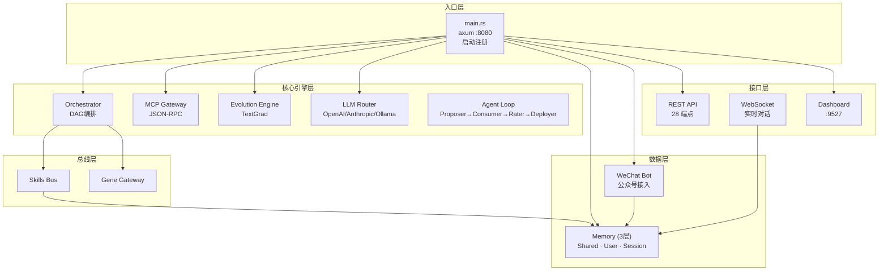

### 模块调用时序

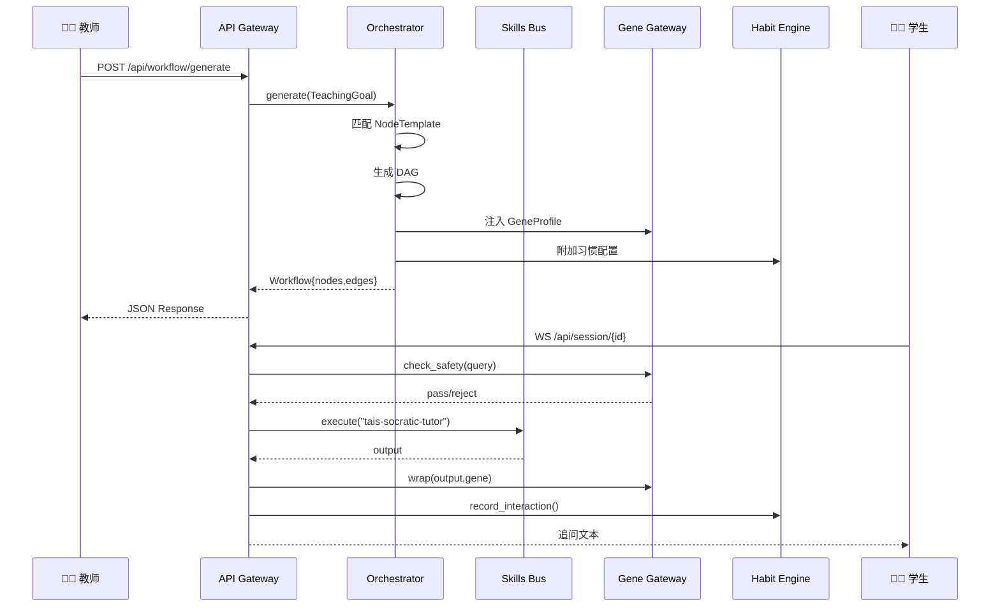

---

## 2. Skills Bus — 完整生命周期

### install → register → execute → unregister → uninstall

7 个内置 TAIS 技能在 `main.rs` 启动时自动 install + register：

| 技能 | 功能 | LLM | Fallback |
|------|------|:---:|:---:|
| `tais-socratic-tutor` | 苏格拉底式追问引导 | ✅ | ✅ 4策略规则 |
| `tais-workflow` | 教学 DAG 编排 | ✅ | ✅ 3节点默认DAG |
| `tais-learning-analyst` | 学情分析 | ✅ | ✅ 默认分析 |
| `tais-resource-pusher` | 个性化资源推送 | ✅ | ✅ 基础资源 |
| `tais-skill-coach` | 练习生成+批改 | ✅ | ✅ 默认练习 |
| `tais-feedback-collector` | 反馈采集+满意度 | ✅ | ✅ 基础反馈 |
| `tais-evolution` | 策略自进化优化 | ✅ | ✅ 默认建议 |

### Skills API (8 端点)

| 方法 | 路径 | 说明 |
|------|------|------|
| GET | `/api/skills/list` | 列出已注册技能 |
| GET | `/api/skills/status` | 全部状态（含注册/安装） |
| POST | `/api/skills/install` | 安装新技能定义 |
| POST | `/api/skills/{name}/register` | 注册（激活） |
| DELETE | `/api/skills/{name}` | 反注册（停用保定义） |
| DELETE | `/api/skills/{name}/install` | 反安装（删除定义） |
| POST | `/api/skills/{name}/execute` | 执行技能 |

### 目标解析

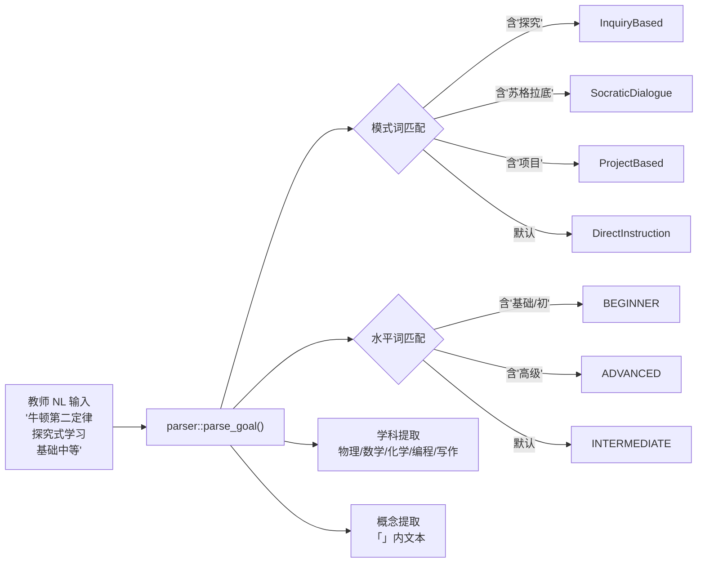

### DAG 生成

输入 `TeachingGoal` 后，Orchestrator 按以下算法生成 `Workflow`：

**算法 1: 工作流 DAG 生成**

1. 按 `goal.mode` 筛选匹配的 `NodeTemplate[]`
2. 按 `phase` 升序排列（0=课前, 1=课中, 2=课后, 3=审查）
3. 对每个模板：实例化为 `WorkflowNode`，注入 `gene` 和 `hitl_trigger`
4. 按序添加边 $v_i \to v_{i+1}$
5. 追加终端审查节点（始终触发 HITL）

时间复杂度：$O(n \log n)$，其中 $n$ 为模板数量。

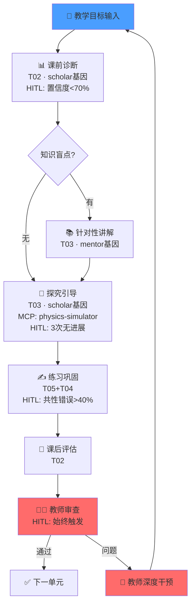

### 节点执行

每个节点执行时：

1. **基因注入**: `GeneGateway::modify_parameters()`
2. **技能调度**: `SkillsBus::execute(agent, input, gene)`
3. **基因包装**: `GeneGateway::wrap(output, gene)`
4. **HITL 检查**: 评估触发条件，生成 `HitlEvent`
5. **习惯记录**: `HabitEngine::record_node_result()`

---

## 2.5 任务编排子系统 (Task Orchestration)

### 五问五答

| 问题 | 答案 | API |
|------|------|-----|
| 如何列出任务 | 按 workflow 查询，按 priority 排序 | `GET /api/tasks/workflow/{id}` |
| 如何分派任务 | assign → start → agent 执行 | `POST /api/tasks/{id}/start` |
| 如何监督状态 | 实时查询 status + workflow_summary | `GET /api/tasks/workflow/{id}/summary` |
| 如何增减任务 | CRUD 操作 | `POST/PUT/DELETE /api/tasks` |
| 如何中断任务 | 手动中断（任意原因） | `POST /api/tasks/{id}/interrupt?reason=` |

### 任务状态机

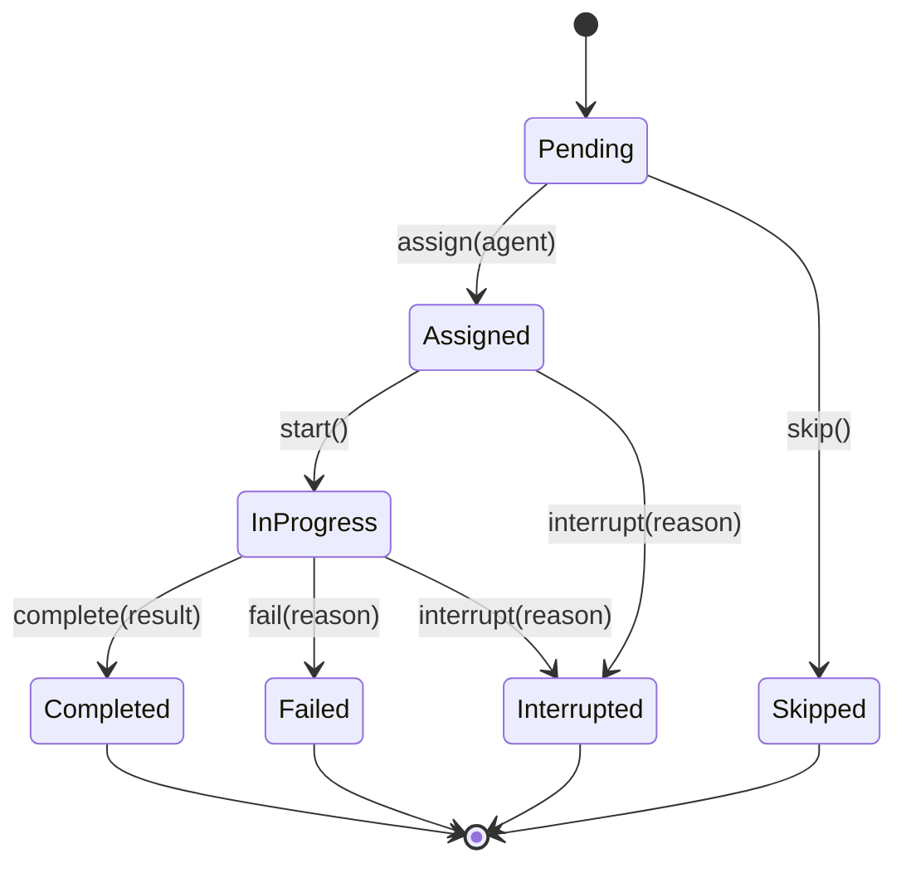

### 核心数据结构

```rust
pub struct Task {
    pub id: String,
    pub workflow_id: String,
    pub name: String,
    pub description: String,
    pub assigned_agent: Vec<String>,
    pub status: TaskStatus,
    pub priority: u32,                    // lower = more urgent
    pub dependencies: Vec<String>,        // must complete before this
    pub created_at: NaiveDateTime,
    pub started_at: Option<NaiveDateTime>,
    pub completed_at: Option<NaiveDateTime>,
    pub result: Option<String>,
    pub interrupt_reason: Option<String>,
}

pub enum TaskStatus {
    Pending,      // 等待分派
    Assigned,     // 已分配给 agent
    InProgress,   // 执行中
    Completed,    // 已完成
    Failed,       // 失败
    Interrupted,  // 中断（手动或 HITL）
    Skipped,      // 跳过
}
```

### 分派流程

```
1. CREATE task → status=Pending
2. ASSIGN agent → status=Assigned
3. START → status=InProgress (检查 dependencies_met?)
4. Agent 执行（SkillsBus/MCP）
5. COMPLETE/Fail → status=Completed/Failed
   or HITL trigger → status=Interrupted
```

### 依赖检查

`dependencies_met()` 在所有依赖项状态为 `Completed` 或 `Skipped` 时返回 true，否则 `next_ready()` 不会返回该任务。

### 监督端点

```
GET /api/tasks/workflow/{id}/summary
→ {
    "workflow_id": "wf1",
    "total": 5,
    "completed": 2,
    "failed": 0,
    "interrupted": 1,
    "in_progress": 1,
    "pending": 1,
    "progress_pct": 40
}
```

### 新增 API（7 端点）

| 方法 | 路径 | 说明 |
|------|------|------|
| GET | `/api/tasks/workflow/{id}` | 列出 workflow 所有任务 |
| POST | `/api/tasks/workflow/{id}` | 创建任务 `{name, description, agent?, dependencies?}` |
| PUT | `/api/tasks/{id}` | 更新任务 |
| DELETE | `/api/tasks/{id}` | 删除任务 |
| POST | `/api/tasks/{id}/start` | 开始执行任务 |
| POST | `/api/tasks/{id}/complete` | 完成任务 `{result: "..."}` |
| POST | `/api/tasks/{id}/interrupt?reason=` | 中断任务 |
| GET | `/api/tasks/workflow/{id}/summary` | 进度摘要 |

---

## 2.6 自主教学 Agent 闭环 (v0.1.0 新增)

```
教师输入 → Proposer(LLM提案) → Consumer(SkillsBus执行) → Rater(5维评分) → Deployer(进化部署)
     ↑                                                                          │
     └──────────────────── 教学反馈闭环 ─────────────────────────────────────────┘
```

| 文件 | 功能 | 核心依赖 |
|------|------|---------|
| `agent/proposer.rs` | LLM 分析学情 → 优先级+策略 → TaskProposal | LlmRouter::chat_simple |
| `agent/consumer.rs` | SkillsBus 真执行 + session 历史记录 | SkillsBus::execute |
| `agent/rater.rs` | 5维评分 (comprehension/engagement/relevance/strategy_fit/overall) | LlmRouter |
| `agent/deployer.rs` | ≥80%自动部署 / 60-79%保留 / 35-59%标记 / <35%淘汰 | EvolutionEngine |
| `agent/loop.rs` | 闭环编排 + 状态机 (Idle→Running→Idle) | 以上全部 |

### 新增 API (4 端点)

| 方法 | 路径 | 说明 |
|------|------|------|
| POST | `/api/agent/propose` | LLM 分析学情 → 提案教学任务 |
| POST | `/api/agent/run` | 跑一轮完整闭环（提案→执行→评分→决策） |
| GET | `/api/agent/status` | 闭环统计（deployed/retained/flagged/retired 数量） |
| POST | `/api/agent/reset` | 重置闭环状态 |

### Proposer 策略选择

| 掌握度 | 优先级 | 推荐策略 |
|--------|--------|---------|
| < 30% | Critical | scaffold（拆解子问题） |
| 30-50% | High | clarification（追问澄清） |
| 50-70% | Medium | drill（练习巩固） |
| > 70% | Low | enrichment（进阶资源） |

### Deployer 决策

| 综合分 | 动作 | 基因调整 |
|--------|------|---------|
| ≥ 0.8 | 🚀 Deploy | personality → "mentor" |
| 0.6-0.79 | 📦 Retain | 无变化 |
| 0.35-0.59 | 🚩 FlagForReview | 标记审查 |
| < 0.35 | 🗑️ Retire | personality → "scholar", risk → "strict" |


## 3. MCP Gateway

### 三层架构

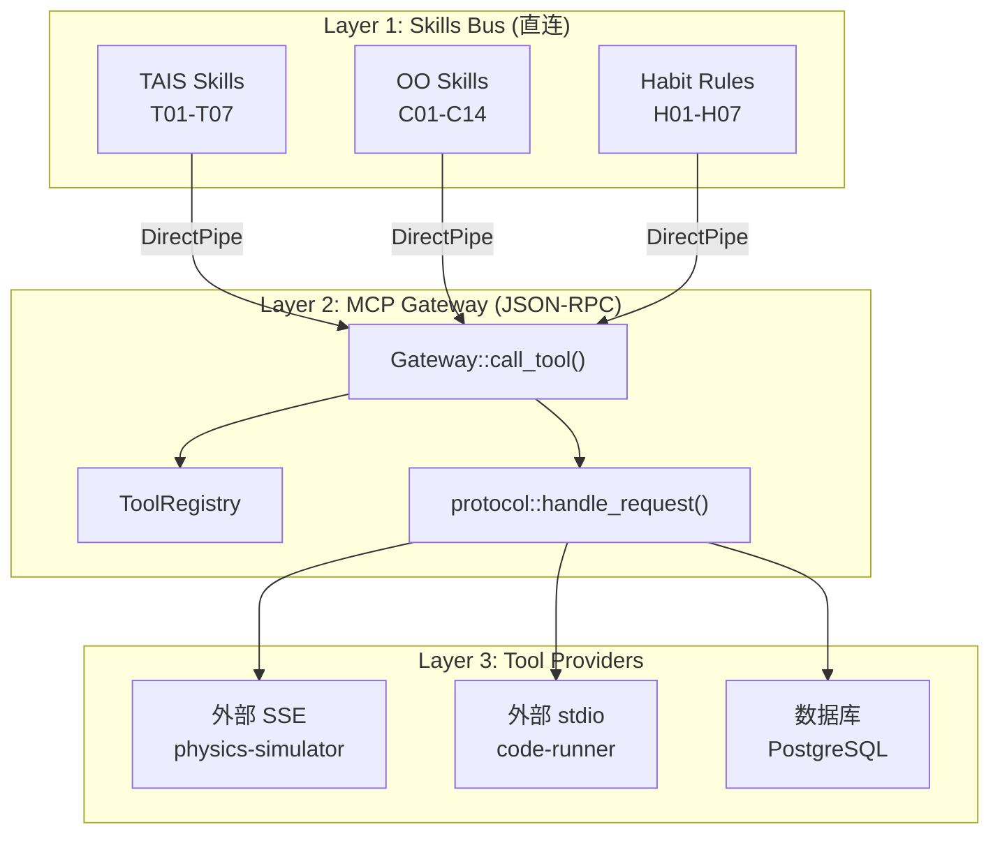

### JSON-RPC 协议

**请求格式**:

```json
{
  "jsonrpc": "2.0",
  "id": 1,
  "method": "tools/call",
  "params": {
    "name": "physics-simulator",
    "arguments": {"force": 10, "mass": 2}
  }
}
```

**调用路径选择**:

```
call_tool(name, params):
  1. direct_pipes.get(name)   → 命中: 直接调用 (零延迟)
  2. external_servers.find()  → 命中: POST SSE / 启动 stdio
  3. 都不命中                   → ToolNotFound
```

### 工具注册

启动时从 `main.rs` 批量注册 35 个胶囊：

```
oo-prd-generator ... oo-code-scaffold  (14 OO)
gene-personality ... gene-heredity     (7 基因)
tais-workflow ... tais-evolution       (7 TAIS)
habit-review ... habit-collaboration   (7 习惯)
```

---

## 4. Evolution Engine 自进化引擎

### 进化闭环

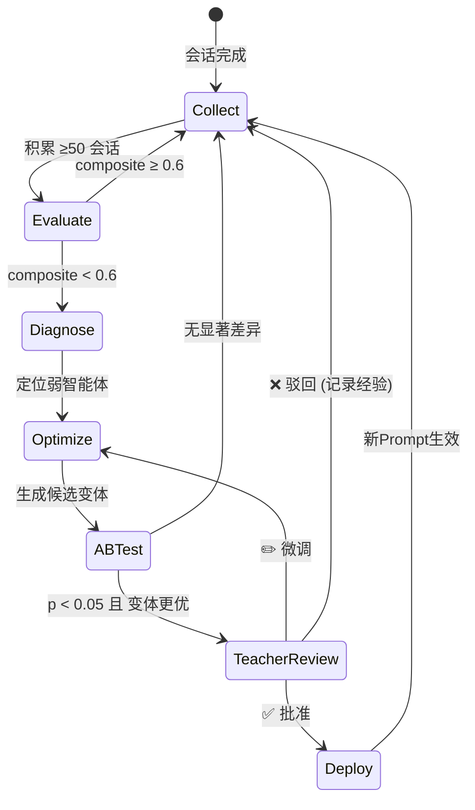

### 多维评估指标

评估函数 $E: \text{SessionRecord}[] \to \text{EvolutionMetrics}$

**1. 学习有效性 (Learning Effectiveness)** — 归一化增益

$$\text{LE} = \frac{1}{N}\sum_{i=1}^{N} \frac{\text{post}_i - \text{pre}_i}{1 - \text{pre}_i}$$

权重：$w_1 = 0.35$

**2. 教学效率 (Teaching Efficiency)** — 突破率

$$\text{TE} = \frac{1}{N}\sum_{i=1}^{N} \frac{\text{breakthroughs}_i}{\text{rounds}_i}$$

权重：$w_2 = 0.25$

**3. 学生自主性 (Student Autonomy)** — HITL 独立率

$$\text{SA} = 1 - \frac{1}{N}\sum_{i=1}^{N} \min(\text{hitl\_escalations}_i, 1)$$

权重：$w_3 = 0.20$

**4. 资源参与度 (Resource Engagement)** — 点击率

$$\text{RE} = \frac{\sum \text{clicked}_i}{\sum \text{pushed}_i}$$

权重：$w_4 = 0.10$

**5. 教师满意度 (Teacher Satisfaction)** — 人工评分

$$\text{TS} = \frac{1}{|\{i: \text{rated}_i\}|}\sum_{i: \text{rated}} \text{rating}_i$$

权重：$w_5 = 0.10$

**综合评分**:

$$\text{composite} = \sum_{k=1}^{5} w_k \cdot \text{metric}_k$$

---

### TextGrad 优化

**算法 2: Prompt 变体生成**

```
输入: current_prompt, diagnosis
输出: improved_prompt

规则:
  if diagnosis contains "追问轮次多":
    append "拆解为3-5个递进小问题\n每次只改变一个变量\n卡住时退回上层"
  elif diagnosis contains "推送多点击少":
    append "每次只推2个\n第一个:可视化(降认知负荷)\n第二个:交互(即时检验)"
  elif diagnosis contains "反馈不够具体":
    append "指出问题但给方向提示\n对比式提问\n分层反馈:语法→逻辑→效率"
  elif diagnosis contains "自主完成率低":
    append "先让学生尝试\n3次无进展才给提示\n使用Socratic追问"
```

V2 将替换为真实 LLM 调用：

$$\text{prompt}_{t+1} = \text{LLM}(\text{prompt}_t, \text{diagnosis}, \text{constraints}_{\text{teacher}})$$

---

### A/B 统计检验

采用 Welch's t-test:

$$t = \frac{\bar{X}_v - \bar{X}_c}{\sqrt{\frac{s_v^2}{n_v} + \frac{s_c^2}{n_c}}}$$

自由度 (Welch-Satterthwaite):

$$\nu = \frac{\left(\frac{s_v^2}{n_v} + \frac{s_c^2}{n_c}\right)^2}{\frac{(s_v^2/n_v)^2}{n_v-1} + \frac{(s_c^2/n_c)^2}{n_c-1}}$$

判定：若 $p < 0.05$ 且 $\bar{X}_v > \bar{X}_c$，则变体显著更优。

---

## 5. 基因网关

### LLM Router 新增方法

**V2 已实现**: 全部 LLM 真实调用, 不再使用规则引擎。

```rust
/// 便捷方法: 一次调用返回 content 字符串
pub async fn chat_simple(&self, system_prompt: &str, user_prompt: &str) 
    -> Result<String, LlmError> {
    let messages = vec![ChatMessage::user(user_prompt)];
    let response = self.chat(&messages, Some(system_prompt), None).await?;
    Ok(response.content)
}
```

所有 7 个 TAIS 技能 + Agent 闭环均通过 `LlmRouter::chat_simple()` 真实调用 LLM,
失败时自动回退到规则引擎 fallback（含 `tracing::warn!` 日志）。

### 拦截模型

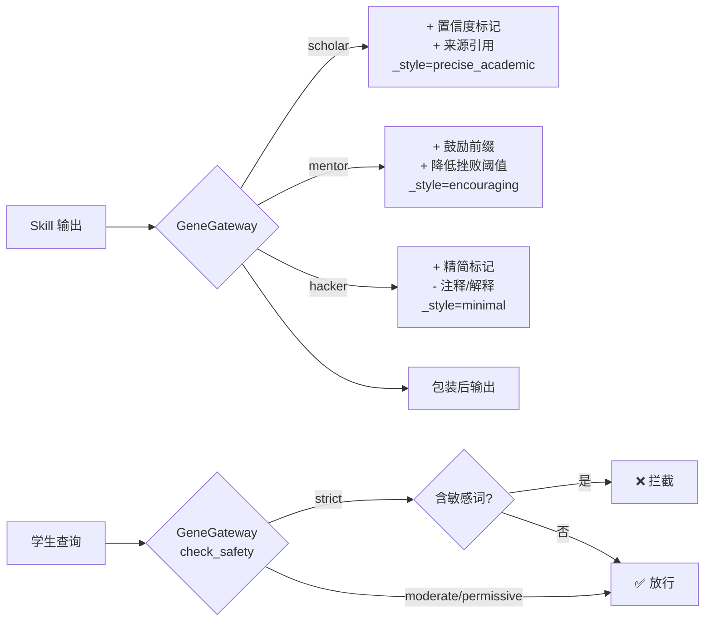

### 人格参数修改

| 基因 | 注入参数 | 效果 |
|------|---------|------|
| scholar | `precision=high, citation_required=true` | 严谨学术风格 |
| mentor | `tone=warm, max_frustration_rounds=5` | 温和鼓励风格 |
| hacker | `brevity=max, comments=false` | 极简代码风格 |

---

## 6. 习惯引擎 (Habit Engine) — V2 实现

### 架构

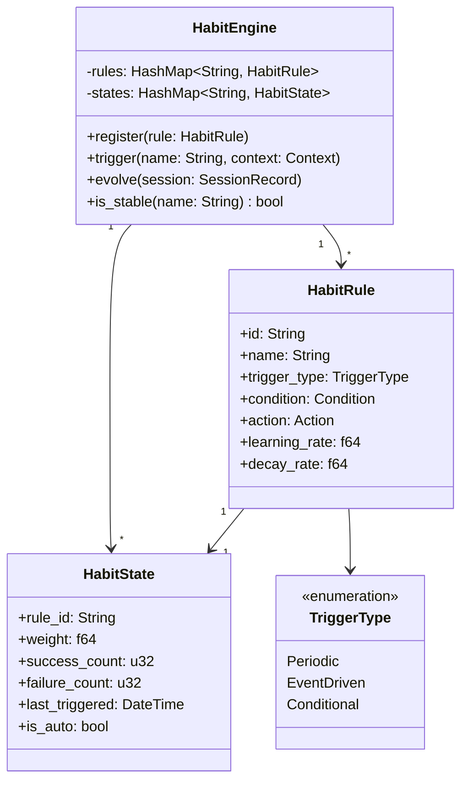

### 习惯状态更新

```rust
impl HabitEngine {
    /// 更新习惯权重
    pub fn update_weight(&mut self, rule_id: &str, success: bool) {
        let state = self.states.get_mut(rule_id);
        let eta = self.rules[rule_id].learning_rate;
        let lambda = self.rules[rule_id].decay_rate;

        // H(t+1) = H(t) + η·success - λ·(1 - frequency)
        let frequency = state.recent_frequency(20); // 滑动窗口 N=20
        if success {
            state.weight = (state.weight + eta).min(1.0);
            state.success_count += 1;
        } else {
            state.weight = (state.weight - lambda * (1.0 - frequency)).max(0.0);
            state.failure_count += 1;
        }

        // 检查习惯是否稳定
        if state.weight > THETA_STABLE {  // θ_stable = 0.8
            state.is_auto = true;  // 自动执行
        }
        if state.weight < THETA_RETRAIN {  // θ_retrain = 0.3
            state.is_auto = false;  // 重新训练
        }
    }
}
```

### 习惯生命周期

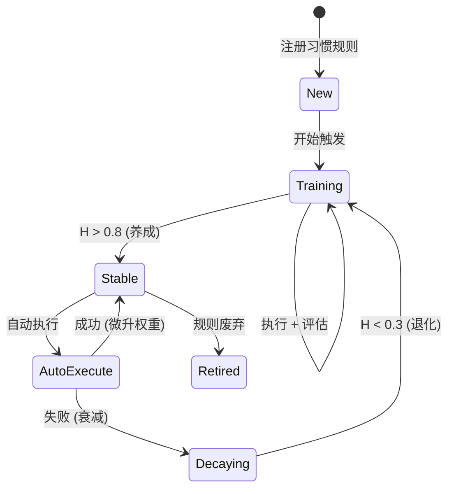

### 习惯触发时序

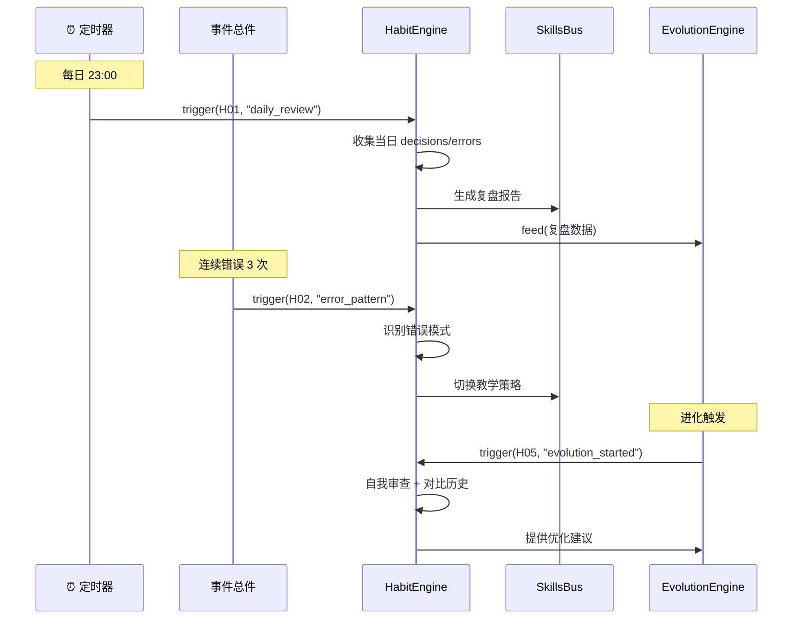

---

## 7. 核心类型定义

### 习惯胶囊类型

```rust
/// 习惯规则定义
pub struct HabitRule {
    pub id: String,
    pub name: String,
    pub description: String,
    pub trigger_type: HabitTriggerType,
    pub condition: HabitCondition,
    pub action: HabitAction,
    pub learning_rate: f64,  // η
    pub decay_rate: f64,     // λ
}

/// 触发类型
pub enum HabitTriggerType {
    Periodic { interval: chrono::Duration },
    EventDriven { event: String },
    Conditional { predicate: String },
}

/// 习惯状态
pub struct HabitState {
    pub rule_id: String,
    pub weight: f64,           // H(t) ∈ [0, 1]
    pub success_count: u32,
    pub failure_count: u32,
    pub streak: u32,           // 连续成功次数
    pub last_triggered: chrono::NaiveDateTime,
    pub is_auto: bool,         // 是否自动执行
}

/// 习惯条件
pub enum HabitCondition {
    Always,
    ErrorPattern { consecutive_errors: u32 },
    CompositeBelow { threshold: f64 },
    HighRiskOperation,
    CollaborationMode,
}
```

### 三胶囊联动接口

```rust
/// Agent 执行上下文 — 三胶囊同时注入
pub struct AgentContext {
    pub capabilities: Vec<String>,  // 能力胶囊名
    pub gene_profile: GeneProfile,  // 基因配置
    pub habit_state: Vec<HabitState>, // 当前习惯状态
}

/// 三胶囊联动执行
impl AgentContext {
    pub async fn execute(
        &mut self,
        skill_name: &str,
        input: Value,
    ) -> Result<Value, Error> {
        // 1. 基因注入参数
        let mut params = input.clone();
        GeneGateway::modify_parameters(&mut params, &self.gene_profile);

        // 2. 习惯前置检查
        for habit in &self.habit_state {
            if habit.is_auto {
                // 自动执行习惯动作
                params = self.apply_habit(habit, params);
            }
        }

        // 3. 执行技能
        let output = self.skills_bus.execute(skill_name, params).await?;

        // 4. 基因包装输出
        let wrapped = GeneGateway::wrap(&output, &self.gene_profile);

        // 5. 习惯后置记录
        self.habit_engine.record(skill_name, &wrapped);

        Ok(wrapped)
    }
}
```

---

## 8. Memory 三层记忆模块

### 文件结构

```
src/memory/
├── mod.rs      — SessionMemory (高层 API, 三层整合)
├── shared.rs   — SharedMemory (集体知识库)
└── user.rs     — UserMemoryStore (个人档案)
```

### 核心数据结构

```rust
// Shared Memory — 所有用户共享
pub struct SharedMemory {
    knowledge: RwLock<HashMap<String, KnowledgeNode>>,
    faqs: RwLock<Vec<FaqEntry>>,
    stats: RwLock<CrossStats>,
    strategies: RwLock<HashMap<String, StrategyEntry>>,
}

// User Memory — 每个学生独有
pub struct UserProfile {
    pub user_id: String,
    pub display_name: Option<String>,
    pub grade_level: Option<String>,
    pub mastery: HashMap<String, MasteryEntry>,        // concept→(level,exposures)
    pub misconceptions: Vec<MisconceptionRecord>,       // 持续误解追踪
    pub preferred_style: Option<String>,
}

// Session Memory — 单次对话
pub struct SessionMemory {
    store: Arc<ConversationStore>,       // session_id → Vec<Turn>
    retriever: ContextRetriever,         // 近期对话检索
    pub shared: Arc<SharedMemory>,       // 共享记忆引用
    pub users: Arc<UserMemoryStore>,     // 用户记忆引用
    session_users: RwLock<HashMap<String, String>>,  // session→user映射
}
```

### 上下文拼接算法

`build_full_context(session_id, concept_hint)`:

1. **Shared 层**: 调用 `shared.build_shared_context(hint)` → 获取知识点、FAQ、全局难点
2. **User 层**: 通过 `session_users` 查询 user_id → 获取掌握度、误解档案
3. **Session 层**: 调用 `retriever.build_context_prompt(session_id)` → 最近N轮对话
4. 按 Shared → User → Session 顺序拼接，注入 LLM system prompt

### 掌握度更新公式

$$M_c(t+1) = \begin{cases} \frac{M_c(t) \cdot (n-1) + 1}{n} & \text{正确} \\ \frac{M_c(t) \cdot (n-1) + 0.2}{n} & \text{错误} \end{cases}$$

### API 端点（16 个）

| 方法 | 路径 | 说明 |
|------|------|------|
| GET | `/api/memory/sessions` | 列出会话 |
| GET | `/api/memory/sessions/{id}` | 会话历史 |
| GET | `/api/memory/search?q=` | 跨会话搜索 |
| GET/POST | `/api/memory/shared/knowledge` | 知识点 CRUD |
| GET | `/api/memory/shared/knowledge/search?q=` | 搜索知识点 |
| GET/POST | `/api/memory/shared/faqs` | FAQ 管理 |
| GET | `/api/memory/shared/faqs/search?q=` | 搜索 FAQ |
| GET | `/api/memory/shared/stats` | 跨学生统计 |
| GET/POST | `/api/memory/shared/strategies` | 策略管理 |
| GET | `/api/memory/users` | 用户列表 |
| GET | `/api/memory/users/{id}` | 用户画像 |
| GET | `/api/memory/users/{id}/mastery` | 掌握度+弱点 |

---

## 9. 测试覆盖

```
43/43 passed ✅ (v0.1.0)

=== orchestrator::parser (2 tests) ===
  test_parse_inquiry_goal / test_parse_socratic

=== orchestrator::dag (1 test) ===
  test_dag_order

=== orchestrator::task (8 tests) ===
  test_task_lifecycle / test_task_update / test_remove_task
  test_dependencies / test_interrupt_task / test_workflow_summary
  test_dispatch_spawns_green_thread / test_dependencies_met_logic

=== memory::shared (5 tests) ===
  test_upsert_and_search_knowledge / test_faq_search_and_rank
  test_record_and_get_stats / test_strategies / test_build_shared_context

=== memory::user (6 tests) ===
  test_get_or_create_profile / test_mastery_update
  test_mastery_categories / test_weakest_concepts
  test_build_user_context / test_list_users

=== memory::session (10 tests) ===
  test_record_and_retrieve / test_search / test_recent_limit
  test_empty_session / test_session_user_linking
  test_three_layer_context_empty / test_three_layer_context_with_session
  test_three_layer_context_with_user / test_three_layer_context_with_shared_knowledge
  test_record_exchange_with_user

=== wechat (4 tests) ===
  test_parse_text_message / test_build_reply
  test_session_creation / test_signature_verification

=== evolution (5 tests) ===
  test_perfect_session / test_poor_session
  test_variant_generation / test_ab_significant / test_ab_not_significant

=== gene (3 tests) ===
  test_scholar_wrap / test_mentor_wrap / test_safety_block
```

---

## 9. 性能特征

| 操作 | 复杂度 | 说明 |
|------|--------|------|
| 工作流生成 | $O(n \log n)$ | n=模板数量(常数级) |
| MCP 工具调用 | $O(1)$ 直连 / $O(m)$ SSE | m=外部服务器数 |
| 进化评估 | $O(N)$ | N=会话数 |
| 习惯状态更新 | $O(1)$ | HashMap 查找 |
| DAG 拓扑排序 | $O(V+E)$ | petgraph 标准算法 |

---

## 10. 编译与运行

### 环境要求

- Rust 1.95+ (2024 Edition)
- GCC 14 + bfd linker
- PostgreSQL 15+ (可选，V2 启用)

### 编译

```bash
cd tais-core
RUSTFLAGS="-Clink-self-contained=no \
           -Clink-args=-fuse-ld=bfd \
           -Lnative=/usr/lib/gcc/x86_64-linux-gnu/14 \
           -Lnative=/usr/lib/x86_64-linux-gnu" \
cargo build --release
```

> **为什么需要 RUSTFLAGS**: 容器内 Rust 工具链是 graft 安装的，缺少 `rust-lld`。`-Clink-self-contained=no -Clink-args=-fuse-ld=bfd` 强制使用系统 GCC/bfd 链接器。

### 运行

```bash
cargo run
# → TAIS server listening on http://0.0.0.0:9527
```

### 测试

```bash
RUSTFLAGS="..." cargo test
# → 36 passed, 0 failed
```

---

## 11. 关键设计决策

| 决策 | 理由 |
|------|------|
| **Rust 而非 Python** | 类型安全 + 零成本抽象 + 无 GIL（WebSocket 并发） + 部署单二进制 |
| **petgraph DAG** | 教学流程天然是有向无环图，拓扑排序 $O(V+E)$ 确保执行顺序 |
| **静态方法 GeneGateway** | 基因注入是无状态的纯函数，不需要实例化 |
| **HabitEngine 为独立模块** | 习惯引擎有自己的生命周期（周期触发），与 Skills Bus 解耦 |
| **规则解析而非 LLM** | V1 用规则做目标解析和变体生成，减少外部依赖；V2 换 LLM |
| **教师审查闸门默认关闭** | 安全优先：任何时候 `auto_deploy=false` |
| **trait 基 Skills + Habits** | 新胶囊即插即用，符合开闭原则 |
| **JSON-RPC MCP** | 与 MCP 官方协议对齐，工具可跨系统复用 |
| **SSE 优先 MCP 传输** | stdio 需要子进程管理，V1 先用 SSE（HTTP）；V2 加 stdio |

---

## 12. 实现进度

| 优先级 | 功能 | 状态 |
|--------|------|:---:|
| **M1** | ✅ LLM 真实调用（全部技能+Agent） | 已完成 |
| **M1** | ✅ 微信机器人 | 已完成 |
| **M1** | ✅ 三层记忆 (Shared+User+Session) | 已完成 |
| **M1** | ✅ 7 个 TAIS 技能注册到 SkillsBus | 已完成 |
| **M1** | ✅ 自主教学 Agent 闭环 | 已完成 |
| **M1** | ✅ 代码评审 + 修复 (23 项) | 已完成 |
| P0 | **习惯引擎实现**（HabitEngine + 7个习惯胶囊） | 5天 |
| P0 | PostgreSQL 持久化（sqlx migrate + repo） | 2天 |
| P1 | MCP stdio 传输（子进程管理） | 2天 |
| P1 | 习惯跨代遗传（gene-heredity 集成） | 3天 |
| P2 | 进化自动触发（事件驱动） | 1天 |
| P2 | Dashboard 指标连线真实 session store | 1天 |
| P3 | 知识图谱 + 向量检索 | 5天 |
| P3 | 可视化仪表盘 | 5天 |

---

## 13. 项目结构树

```
tais-core/
├── Cargo.toml              (68行) 依赖声明
├── Cargo.lock              (自动生成)
├── PRD.md                  (产品需求文档)
├── IMPL.md                 (本文档)
└── src/
    ├── main.rs             (116行) 入口 + 胶囊注册
    ├── lib.rs              (224行) 核心类型 + MCP RPC
    ├── config.rs           (61行)  配置
    ├── api/
    │   └── mod.rs          (673行) axum 路由 + 28 端点 + WebSocket
    ├── orchestrator/
    │   ├── mod.rs          (224行) Orchestrator + 模板
    │   ├── parser.rs       (92行)  NL → TeachingGoal
    │   ├── dag.rs          (101行) petgraph DAG
    │   └── executor.rs     (130行) 节点执行 + HITL
    ├── mcp/
    │   ├── mod.rs          (169行) Gateway
    │   ├── protocol.rs     (54行)  JSON-RPC 处理
    │   └── registry.rs     (36行)  工具注册表
    ├── evolution/
    │   ├── mod.rs          (181行) EvolutionEngine
    │   ├── collector.rs    (56行)  会话聚合
    │   ├── evaluator.rs    (123行) 五维指标
    │   └── optimizer.rs    (168行) 变体生成 + A/B
    ├── llm/
    │   ├── mod.rs          (417行) LlmRouter + trait + CRUD
    │   ├── openai.rs       (145行) OpenAI provider (含 DeepSeek)
    │   ├── anthropic.rs    (168行) Anthropic provider
    │   └── ollama.rs       (88行)  Ollama provider
    ├── wechat/
    │   └── mod.rs          (280行) 公众号签名验证 + XML + 苏格拉底追问
    ├── memory/
    │   ├── mod.rs          (681行) SessionMemory 高层 API + 三层整合
    │   ├── shared.rs       (471行) SharedMemory (知识/FAQ/统计/策略)
    │   └── user.rs         (434行) UserMemory (画像/掌握度/误解)
    ├── gene/
    │   └── mod.rs          (149行) 基因拦截
    ├── skills/
    │   ├── mod.rs              — 完整生命周期 (install/register/unregister/uninstall)
    │   └── implementations.rs  — 7 个 TAIS 技能实现 (全部 LLM 驱动)
    ├── agent/                  — 自主教学 Agent 闭环 (v0.1.0 新增)
    │   ├── mod.rs              — 模块导出
    │   ├── proposer.rs         — 提案器: LLM 分析学情 → 生成 TaskProposal
    │   ├── consumer.rs         — 消费者: SkillsBus 真执行 + session 历史
    │   ├── rater.rs            — 评分器: 5维指标 + LLM 反馈
    │   ├── deployer.rs         — 部署器: 4级决策 → 进化引擎
    │   └── loop.rs             — 闭环编排 + 状态管理
    ├── habit/                  (V2 规划)
    │   ├── mod.rs               HabitEngine
    │   ├── rules.rs             习惯规则定义
    │   └── state.rs             状态管理
    └── data/
        └── mod.rs          (33行)  数据模型
```

---

## 附录 A: 习惯胶囊速查表

| 编号 | 胶囊 | 触发方式 | 核心动作 | $\eta$ | $\lambda$ |
|------|------|---------|---------|--------|-----------|
| H01 | 复盘 | 每日 23:00 | 总结当日决策 + 错误模式 | 0.10 | 0.05 |
| H02 | 容错 | 连续3次同类错误 | 切换策略 + 调整阈值 | 0.15 | 0.08 |
| H03 | 沟通 | 对话结束 | 确认理解 + 总结共识 | 0.08 | 0.03 |
| H04 | 文档 | 产出变更 | 更新日志 + 版本标注 | 0.05 | 0.10 |
| H05 | 优化 | 进化触发 | 自我审查 + 对比历史 | 0.12 | 0.05 |
| H06 | 安全 | 高风险操作 | 强制检查清单 | 0.20 | 0.02 |
| H07 | 协作 | 多Agent协作 | 握手 + 拆解 + 合并 | 0.08 | 0.06 |

## 附录 B: 公式符号表

| 符号 | 含义 |
|------|------|
| $C$ | 能力胶囊集合 |
| $G$ | 基因胶囊配置 |
| $H(t)$ | 习惯状态向量（时变） |
| $\eta$ | 习惯强化学习率 |
| $\lambda$ | 习惯衰减系数 |
| $\theta_{\text{stable}}$ | 习惯稳定阈值 (0.8) |
| $\theta_{\text{retrain}}$ | 习惯退化阈值 (0.3) |
| $\text{composite}$ | 进化综合评分 |
| $w_k$ | 进化指标权重 |
| $t$ | Welch t统计量 |
| $\nu$ | Welch-Satterthwaite 自由度 |

---

*TAIS Core Engine v0.7.0 · 王新年 · 2026-05-11*  
*Mermaid 图可在 GitHub 直接渲染；LaTeX 公式需 MathJax 支持（GitHub 不支持原生 LaTeX，建议用 VS Code + Markdown Preview Enhanced 预览）*
