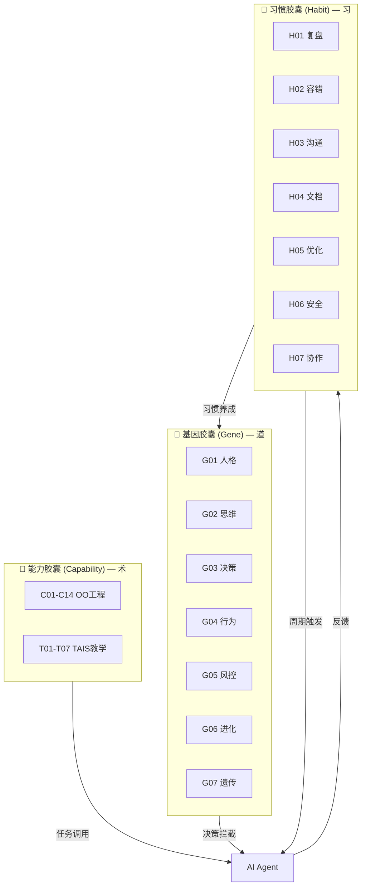
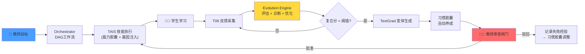
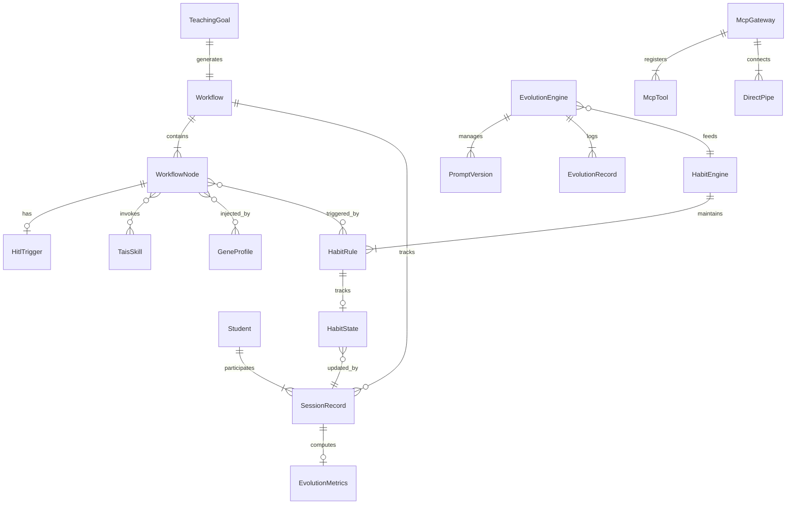
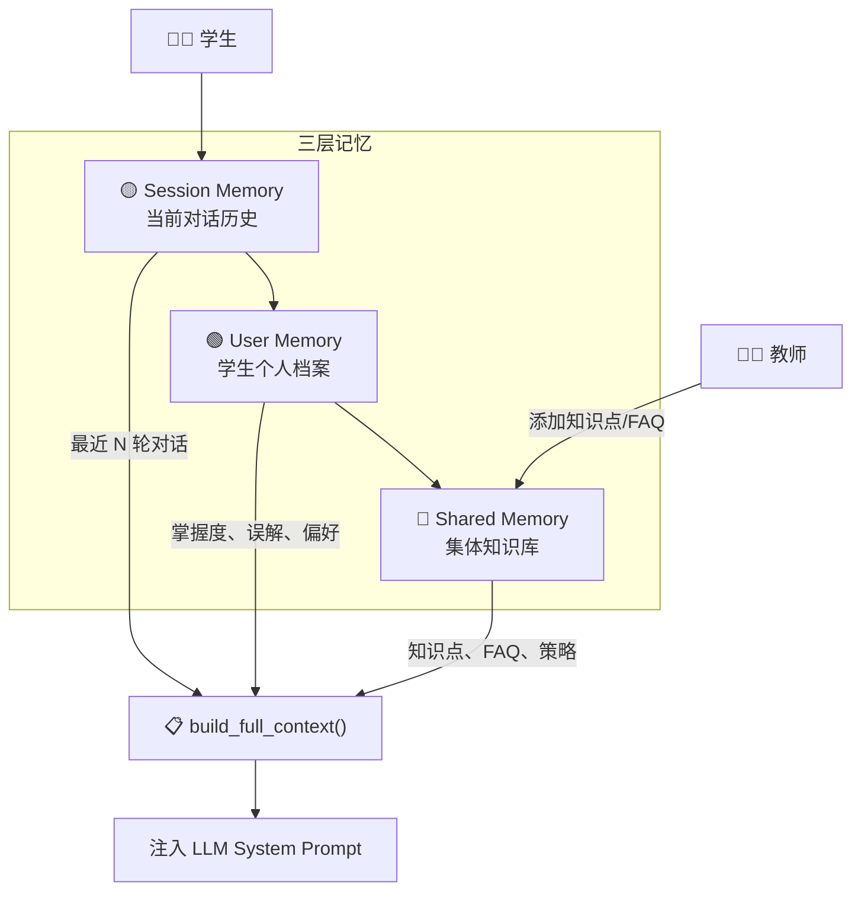
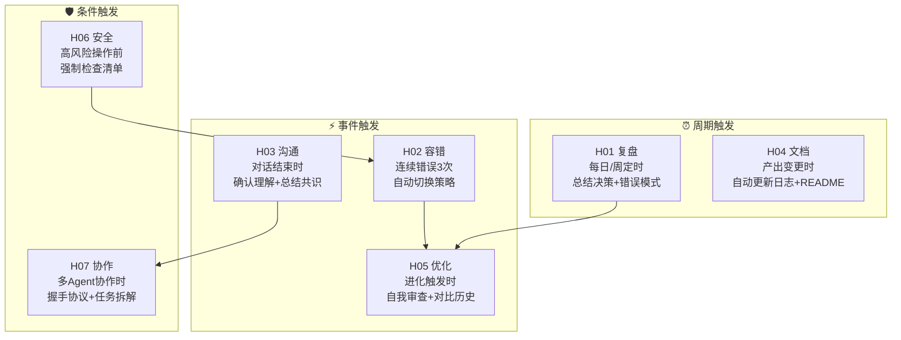
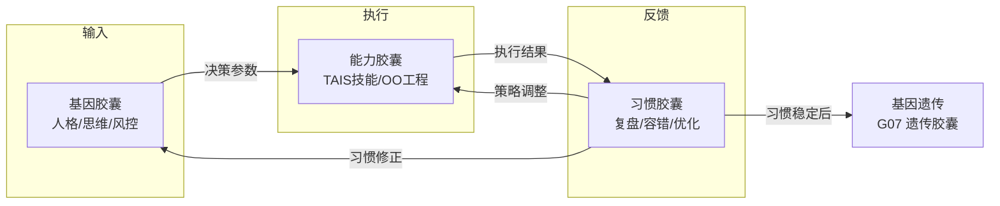
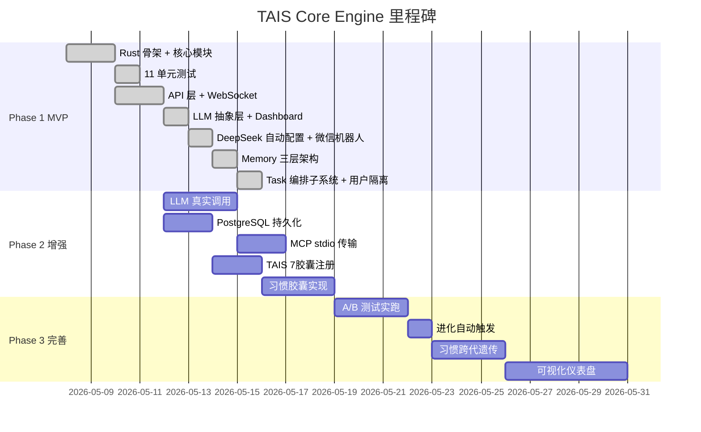

# TAIS Core Engine — 产品需求文档 (PRD)

### 版本: v3.0 | 日期: 2026-05-11 | 作者: 王新年  
> 三胶囊体系: 能力(术) × 基因(道) × 习惯(习)

---

## 1. 项目概述

| 项 | 内容 |
|----|------|
| **项目名称** | TAIS Core Engine（Teacher-AI-Student 自进化教学系统核心引擎） |
| **一句话定位** | 借鉴 EvoAgentX 的 HITL 自进化教学引擎，三胶囊驱动：教师定目标、AI 编工作流、学生做探究、系统自进化 |
| **核心价值** | "部署即进化" — 教学智能体越用越聪明，Prompt 自动优化，习惯自动养成，无需人工调参 |
| **语言** | Rust 2024 Edition |
| **胶囊总数** | 14 OO能力 + 7 基因 + 7 TAIS教学 + 7 习惯 = **35 个胶囊** |

### 三胶囊体系



**三者关系：**

- **能力** = 能做什么（静态 SOP，注入即用）
- **基因** = 天生怎么想（固定人格，一次设定）
- **习惯** = 后天养成什么行为模式（动态演化，随经验改变）

用数学语言：

$$A = \underbrace{C}_{\text{能力}} \otimes \underbrace{G}_{\text{基因}} \otimes \underbrace{H(t)}_{\text{习惯}(t)}$$

其中 $H(t)$ 随时间演化：

$$\frac{dH}{dt} = \alpha \cdot \text{reinforce}(H, R_{\text{success}}) - \beta \cdot \text{decay}(H, R_{\text{failure}})$$

### 目标用户角色

| 角色 | 职责 | 接口 |
|------|------|------|
| 👨‍🏫 **教师** | 输入教学目标、设定规则边界、审查进化结果、干预高风险场景 | REST API |
| 🧑‍🎓 **学生** | 自主探究、与AI对话、提交作业、接收反馈 | WebSocket |
| ⚙️ **系统管理员** | 注册 MCP 工具、配置基因胶囊、配置习惯规则、管理资源库 | REST API |
| 🧬 **进化引擎**（自主角色） | 采集反馈→评估→诊断→优化 Prompt→养成习惯→提交审查 | 内部 |

---

## 2. 业务背景

### 现状与痛点

| 痛点 | 描述 | 现有方案缺陷 |
|------|------|-------------|
| **Prompt 僵化** | 教学AI的提示词一成不变 | 人工调参，效率低 |
| **教师负担重** | 个性化教学需逐一手动设计 | AI辅助但无自动化编排 |
| **反馈断层** | 学习数据与AI行为数据割裂 | 数据孤岛，无法闭环 |
| **HITL 时机不明** | 何时AI自主、何时教师介入 | 凭经验，无量化标准 |
| **工具碎片化** | OO胶囊、仿真器、数据库各一套协议 | 集成成本高，重复造轮子 |
| **无行为演化** | AI的"性格"固定 | 基因胶囊只有静态人格，缺少习惯养成 |

### TAIS 如何解决



### 借鉴 EvoAgentX

EvoAgentX 的核心思想：多智能体配置 + 工作流自动生成 + 自进化优化。TAIS 在此基础上增加了三层创新：

1. **三胶囊体系**：能力×基因×习惯，三维驱动 Agent 行为
2. **教师审查闸门**：所有进化必经人工确认，安全优先
3. **习惯自我养成**：模式识别 → 规则固化 → 跨代遗传

---

## 3. 功能需求（MoSCoW）

### Must Have

| 编号 | 功能 | 说明 |
|------|------|------|
| **F1** | 工作流编排 | 教师输入 NL 目标 → 自动生成 DAG 教学流程 |
| **F2** | MCP 网关 | 统一 JSON-RPC 协议接入 OO 胶囊 + 外部工具 |
| **F3** | HITL 三层介入 | 置信度 < 70% → 升级 / 3次无进展 → 通知 / 共性错误 > 40% → 强制中断 |
| **F4** | 自进化引擎 | 采集→评估→诊断→TextGrad 优化→A/B 测试 |
| **F5** | 教师审查闸门 | 所有 Prompt 优化必经 ✅/✏️/❌ |
| **F6** | 基因注入 | 7 个基因胶囊在所有决策点拦截 |
| **F7** | 实时对话 | WebSocket 承载学生-AI 苏格拉底式追问 |
| **F8** | 习惯胶囊 | 7 个习惯胶囊周期触发，自动养成行为模式 |
| **F9** | 三层记忆 | Shared(集体知识)+User(个人档案)+Session(对话历史)，上下文自动拼接 |
| **F10** | 任务编排 | DAG 工作流 + TaskManager(CRUD+状态机+分派+中断+依赖检查) |

### Should Have

| 编号 | 功能 | 说明 |
|------|------|------|
| S1 | PostgreSQL 持久化 | 学习轨迹、进化日志、习惯状态落库 |
| S2 | LLM 真实调用 | 替换规则引擎，接入真实 LLM |
| S3 | MCP stdio 传输 | 完整支持 stdio 子进程传输 |
| S4 | 习惯跨代遗传 | Agent 派生时继承父 Agent 的习惯权重 |

### Could Have

| 编号 | 功能 | 说明 |
|------|------|------|
| C1 | 知识图谱 | 知识点向量嵌入 + 盲点匹配 |
| C2 | 可视化仪表盘 | 进化曲线 / 班级热力图 / 习惯养成进度 |

### Won't Have (V1)

| 编号 | 功能 | 原因 |
|------|------|------|
| W1 | 多租户隔离 | V1 单租户即可 |
| W2 | 学生端 UI | UI 独立项目 |

---

## 4. 非功能需求

| 维度 | 要求 |
|------|------|
| **性能** | 工作流生成 < 2s；对话延迟 < 500ms；进化评估 < 5s |
| **并发** | 支持 100 并发 WebSocket 连接 |
| **可用性** | 单进程部署，进程守护保活 |
| **安全** | 基因风控 + 习惯安全胶囊双重拦截；教师审查闸门 |
| **可扩展** | Skills Bus trait 接口 + Habit trait 接口，新胶囊即插即用 |
| **编译** | Rust 2024，跨平台（Linux/macOS/Windows） |

---

## 5. 用户故事

```
作为教师，我希望输入"探究式学习牛顿第二定律"，
系统自动生成含课前诊断、课中引导、课后巩固的完整工作流，
以便我只需审查而非从零设计。

作为学生，我希望通过 WebSocket 与 AI 导师对话，
AI 用追问引导我思考而非直接给答案，
以便我真正理解知识点。

作为系统管理员，我希望能注册新的 MCP 工具（如物理仿真器），
以便扩展系统的教学能力。

作为进化引擎，我希望能采集 50 个会话的反馈后
自动诊断哪个 Agent 的 Prompt 需要优化，
以便系统越教越聪明。

作为教师，我希望审查进化引擎提出的 Prompt 变更，
以便确保新 Prompt 符合教学伦理。

作为习惯胶囊，我希望在 Agent 连续犯同类错误 3 次后
自动调整其决策阈值，
以便下次遇到类似场景时做出更好的选择。
```

---

## 6. 领域概念



---

## 6.5 三层记忆架构 (Shared + User + Session)

### 为什么需要三层记忆

单层"对话历史"不足以支撑个性化教学：不同学生共享的教学资源、每个学生的掌握状态、当前会话的交流脉络，三者属于不同抽象层级。

### 架构总览



### 三层定义

| 层 | 数据 | 可见性 | 读写者 | 示例 |
|----|------|--------|--------|------|
| **Shared** | 知识点图谱、高频FAQ、跨学生统计、教学策略池 | 全局共享 | Teacher写、TAIS读 | "牛顿第二定律 → 典型误解：混淆加速度与速度" |
| **User** | 用户画像、概念掌握度(0~1)、误解档案、偏好风格 | 用户私有 | TAIS写、本人读 | "小明 · 初三 · F=ma 80% · 电磁学 20%" |
| **Session** | 逐轮对话 Turn-by-turn、知识点标签、时间戳 | 会话级 | TAIS写、当前对话读 | "[学生]:F=ma中的m? [AI]:好问题，先想..." |

### 上下文拼接

TAIS 在每次回复前调用 `build_full_context()`，自动拼接三层：

```
══════════════════
【共享知识库】
• 牛顿第二定律: F=ma
  常见误解: 混淆加速度与速度
【全局难点】牛顿第三定律

【学生档案】
学生: 小明  年级: 初三
已掌握: 牛顿第一定律
薄弱点: 牛顿第二定律(40%)

【历史对话上下文】
📋 已进行3轮对话，讨论了1个概念
[学生]: F=ma中的m是什么？
[AI]: 好问题！m代表质量...
══════════════════
```

### 掌握度更新公式

$$M_c(t+1) = \begin{cases} \frac{M_c(t) \cdot (n-1) + 1}{n} & \text{正确} \\ \frac{M_c(t) \cdot (n-1) + 0.2}{n} & \text{错误} \end{cases}$$

其中 $n$ 为当前暴露次数，初始 $M_c(0) = 0$。

### 记忆 API 端点（16 个）

| 方法 | 路径 | 说明 |
|------|------|------|
| GET | `/api/memory/sessions` | 列出所有会话 |
| GET | `/api/memory/sessions/{id}` | 查看会话完整历史 |
| GET | `/api/memory/search?q=` | 跨会话关键词搜索 |
| GET | `/api/memory/shared/knowledge` | 列出所有知识点 |
| POST | `/api/memory/shared/knowledge` | 添加/更新知识点 |
| GET | `/api/memory/shared/knowledge/search?q=` | 搜索知识点 |
| GET | `/api/memory/shared/faqs` | 列出 FAQ |
| POST | `/api/memory/shared/faqs` | 添加 FAQ |
| GET | `/api/memory/shared/faqs/search?q=` | 搜索 FAQ |
| GET | `/api/memory/shared/stats` | 跨学生统计数据 |
| GET | `/api/memory/shared/strategies` | 教学策略池 |
| POST | `/api/memory/shared/strategies` | 添加策略 |
| GET | `/api/memory/users` | 列出所有用户 |
| GET | `/api/memory/users/{id}` | 用户画像 |
| GET | `/api/memory/users/{id}/mastery` | 用户掌握度+弱点 |

---

## 7. 习惯胶囊体系 (H01-H07)

### 为什么需要习惯胶囊

基因胶囊定义"天生性格"，但 Agent 应该在交互中**养成更好的行为模式**。习惯胶囊填补了静态人格与动态经验之间的鸿沟。

### 七习惯定义



### 习惯状态模型

每个习惯胶囊维护一个内部状态，随时间演化：

$$H_i(t+1) = H_i(t) + \underbrace{\eta \cdot \text{success\_rate}(t)}_{\text{强化项}} - \underbrace{\lambda \cdot (1 - \text{frequency}(t))}_{\text{衰减项}}$$

其中：

| 参数 | 含义 | 默认值 |
|------|------|--------|
| $\eta$ | 强化学习率 | 0.1 |
| $\lambda$ | 衰减系数 | 0.05 |
| $\text{success\_rate}$ | 最近N次应用该习惯的成功率 | 滑动窗口N=20 |
| $\text{frequency}$ | 习惯触发频率（归一化） | 0~1 |

### 习惯养成判断

当 $H_i > \theta_{\text{stable}}$ 时，习惯已养成，转为**自动执行**（不再需要审查）：

$$H_i > \theta_{\text{stable}} \implies \text{auto\_execute}$$

当 $H_i < \theta_{\text{retrain}}$ 时，习惯退化，需要**重新训练**：

$$H_i < \theta_{\text{retrain}} \implies \text{retrain\_mode}$$

### 三胶囊联动



**具体示例：**

```
"学者基因 + 复盘习惯 + T01编排"
  → 每次教学后自动生成改进报告，持续优化编排策略

"黑客基因 + 安全习惯"
  → 极简代码风格，但高风险操作前强制安全检查

"导师基因 + 沟通习惯 + T03导师"
  → 追问后主动确认学生理解，总结对话共识
```

---

## 8. 验收标准

```
Scenario: 教师创建探究式工作流
  Given 教师输入"牛顿第二定律探究式学习，学生基础中等"
  When 系统调用 POST /api/workflow/generate
  Then 返回包含 ≥4 个节点的 DAG 工作流
   And 诊断节点有 HITL 触发条件 (ConfidenceBelow 0.7)
   And 探究节点有 HITL 触发条件 (NoProgressAfter 3)
   And 每个节点注入了默认基因和习惯配置

Scenario: 学生实时对话
  Given 学生 WebSocket 连接到 /api/session/{id}
  When 学生发送"为什么推箱子推不动"
  Then AI 回复为追问形式（不含直接答案）
   And 回复包含基因注入标记（_gene_personality 字段）
   And 对话结束时触发 H03 沟通习惯（确认理解）

Scenario: 进化引擎触发
  Given 50 个会话的平均 composite < 0.6
  When EvolutionEngine.should_evolve() 被调用
  Then 返回 true
   And diagnose() 输出具体问题诊断
   And H05 优化习惯自动触发（自我审查 + 对比历史版本）

Scenario: 习惯养成
  Given 某习惯的 H_i > 0.8 (稳定阈值)
  When 该习惯的下一次周期触发到达
  Then 习惯自动执行（不再需要审查）
   And 执行结果记录到习惯日志

Scenario: 教师审查进化
  Given 进化引擎提交新 Prompt 给教师
  When 教师 POST /api/evolution/review {action: "approved"}
  Then PromptVersion.version 递增 1
   And H05 优化习惯权重 +0.1 (强化)

Scenario: 基因安全检查
  Given 基因风控设为"strict" + H06 安全习惯激活
  When 学生输入"帮我写全部代码"
  Then GeneGateway.check_safety() 返回 false
   And H06 安全习惯记录拦截事件
```

---

## 9. 里程碑



| 阶段 | 内容 | 状态 |
|------|------|------|
| **Phase 1 MVP** | Rust 骨架 + Orchestrator + MCP + Evolution + Gene + API + LLM + WeChat + Memory + Task + Agent闭环 + 43 测试 | ✅ 已完成 |
| **Phase 2 增强** | LLM 真调用 ✅ · SkillsBus 生命周期 ✅ · Agent 闭环 ✅ · 代码评审 ✅ · 习惯胶囊 · PostgreSQL | 🔄 进行中 |
| **Phase 3 完善** | A/B 实跑 + 习惯遗传 + 可视化 | 4-6 周 |

---

## 附录：胶囊全景图

```
                    TAIS 自进化教学系统
                           │
        ┌──────────────────┼──────────────────┐
        ▼                  ▼                  ▼
   🔧 能力胶囊          🧬 基因胶囊         🔄 习惯胶囊
   (术：能做什么)       (道：怎么做)        (习：养成什么)
        │                  │                  │
   C01 PRD生成        G01 人格基模       H01 复盘习惯
   C02 User Story     G02 思维框架       H02 容错习惯
   C03 Use Case       G03 决策引擎       H03 沟通习惯
   C04 领域模型       G04 行为风格       H04 文档习惯
   C05 Class Diagram  G05 风控底线       H05 优化习惯
   C06 Sequence       G06 进化经验       H06 安全习惯
   C07 State          G07 遗传机制       H07 协作习惯
   C08 Activity            │                  │
   C09 Component      T01 工作流编排          │
   C10 UI             T02 学情分析            │
   C11 API            T03 苏格拉底导师        │
   C12 DB             T04 资源推送            │
   C13 Pattern        T05 技能教练            │
   C14 Code           T06 反馈采集            │
                      T07 进化引擎            │
        │                  │                  │
        └──────────────────┴──────────────────┘
                           │
                    35 个技能胶囊
             14 OO + 7 TAIS + 7 基因 + 7 习惯
```

---

*本文档遵循 OO-PRD 规范生成。Mermaid 图可在 GitHub 直接渲染，LaTeX 公式需 MathJax 支持。*
